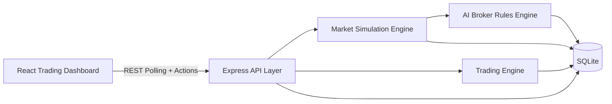

# Broker Simulator Platform MVP (Virtual & Educational)

## 1) Architecture overview
- **Frontend (React dashboard)** polls backend every 2s for prices, account state, trades, and AI insights.
- **Backend (Node.js + Express)** exposes trade/account/market APIs and orchestrates engines.
- **Market Simulation Engine** generates synthetic EUR/USD and BTC/USD ticks using trend + random shock + volatility + fake news impacts.
- **Trading Engine** performs virtual order execution, margin accounting, leverage simulation, and P/L calculations.
- **AI Broker Layer** dynamically widens spreads under stress and logs risk warnings for educational guidance.
- **SQLite database** stores users, balances, market data, trade lifecycle, and AI events.



## 2) Folder structure
```text
src/
  server.js
  simulator/
    db/init.js
    engines/marketSimulation.js
    services/tradingEngine.js
    services/brokerAI.js
    routes/marketRoutes.js
    routes/tradeRoutes.js
    routes/accountRoutes.js
frontend/
  src/App.jsx
  src/styles.css
docs/broker_simulator_mvp.md
sql/broker_simulator.db
```

## 3) Backend code
- Entry point: `src/server.js`
- Feature modules under `src/simulator/*`

## 4) Market simulation engine code
- `startMarketSimulation()` updates each symbol every 1.5s.
- Formula: `new_price = old_price * (1 + randomShock + trend + newsImpact + aiAdjustment)`.

## 5) Trading engine code
- **POST `/trade/open`** simulates execution at ask (BUY) or bid (SELL).
- Margin = `(price * lotSize) / leverage`.
- **POST `/trade/close`** uses opposite side quote and computes leveraged P/L.

## 6) AI layer prompts (control examples)
System prompt examples:
1. "You are a simulated broker risk model. If volatility spikes or news impact exceeds threshold, increase spread and emit warning. Never provide real investment advice."
2. "You are an educational broker assistant. Explain risk of leverage, margin usage, and drawdowns in plain language."
3. "Maintain SAFE mode: synthetic market only, no live execution, no external exchange integration."

## 7) Database schema
- `users(1) -> balances(1)`
- `users(1) -> trades(N)`
- `market_data` for tick history
- `ai_logs` for assistant/risk events

## 8) API routes + examples
### GET `/market/prices`
```json
{ "data": [{ "symbol": "EUR/USD", "bid": 1.08491, "ask": 1.08512 }] }
```

### POST `/trade/open`
Request:
```json
{ "userId": 1, "symbol": "BTC/USD", "side": "BUY", "lotSize": 1, "leverage": 20 }
```
Response:
```json
{ "tradeId": 12, "openPrice": 62123.12, "marginUsed": 3106.16 }
```

### POST `/trade/close`
Request:
```json
{ "userId": 1, "tradeId": 12 }
```
Response:
```json
{ "tradeId": 12, "closePrice": 62300.55, "pnl": 3548.6 }
```

### GET `/account`
```json
{ "user_id": 1, "equity": 10432.8, "free_margin": 9400.2, "used_margin": 1000.0 }
```

### GET `/account/trades`
```json
{ "data": [ { "id": 12, "symbol": "BTC/USD", "status": "OPEN" } ] }
```

## 9) Frontend React UI code
- `frontend/src/App.jsx` includes:
  - live prices panel
  - order ticket with buy/sell
  - account balance panel
  - open trades table with close action
  - AI insights panel

## Safety constraints
- Fully simulated data and execution only.
- No real brokerage integration or market connection.
- Educational warnings via AI layer.
